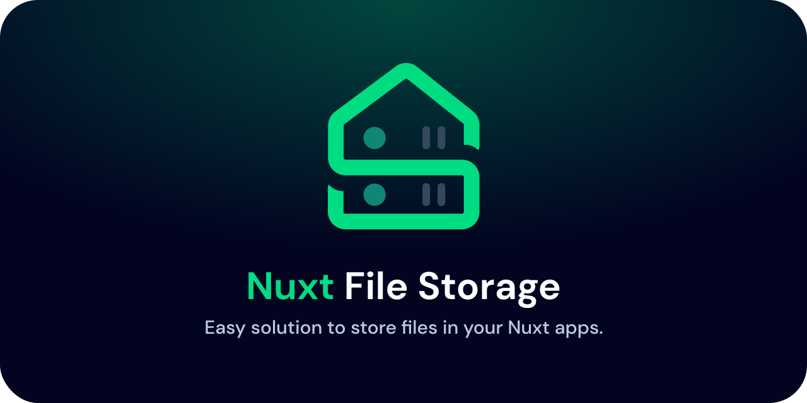

# Nuxt File Storage

[](https://badges.pufler.dev)
[![npm version][npm-version-src]][npm-version-href]
[![npm downloads][npm-downloads-src]][npm-downloads-href]
[![License][license-src]][license-href]
[![Nuxt][nuxt-src]][nuxt-href]

Easy solution to store files in your nuxt apps. Be able to upload files from the frontend and receive them from the backend to then save the files in your project.

-  [✨ &nbsp;Release Notes](/CHANGELOG.md)
-  [🏀 Online playground](https://stackblitz.com/github/NyllRE/nuxt-file-storage?file=playground%2Fapp.vue)
<!-- - [📖 &nbsp;Documentation](https://example.com) -->

## Features

<!-- Highlight some of the features your module provide here -->

-  📁 &nbsp;Get files from file input and make them ready to send to backend
-  ⚗️ &nbsp;Serialize files in the backend to be able to use them appropriately
-  🖴 &nbsp;Store files in a specified location in your Nuxt backend with Nitro Engine

## Quick Setup

1. Add `nuxt-file-storage` dependency to your project

```bash
# Using pnpm
pnpm add -D nuxt-file-storage

# Using yarn
yarn add --dev nuxt-file-storage

# Using npm
npm install --save-dev nuxt-file-storage
```

2. Add `nuxt-file-storage` to the `modules` section of `nuxt.config.ts`

```js
export default defineNuxtConfig({
	modules: ['nuxt-file-storage'],
})
```

That's it! You can now use Nuxt Storage in your Nuxt app ✨

## Configuration

You can currently configure a single setting of the `nuxt-file-storage` module. Here is the config interface:

```js
export default defineNuxtConfig({
	modules: ['nuxt-file-storage'],
	fileStorage: {
		// enter the absolute path to the location of your storage
		mount: '/home/$USR/development/nuxt-file-storage/server/files',

		// {OR} use environment variables (recommended)
		mount: process.env.mount
		// you need to set the mount in your .env file at the root of your project
	},
})
```

## Usage

### Handling Files in the frontend
You can use Nuxt Storage to get the files from the `<input>` tag:

```html
<template>
	<input type="file" @input="handleFileInput" />
</template>

<script setup>
	// handleFileInput can handle multiple files
	// clearOldFiles: true by default, each time the user adds files the `files` ref will be cleared
	const { handleFileInput, files } = useFileStorage({ clearOldFiles: false })
</script>
```
The `files` return a ref object that contains the files

> `handleFileInput` returns a promise in case you need to check if the file input has concluded

<br>

Here's an example of using files to send them to the backend
```html
<template>
	<input type="file" @input="handleFileInput" />
	<button @click="submit">submit</button>
</template>

<script setup>
const { handleFileInput, files } = useFileStorage()

const submit = async () => {
	const response = await $fetch('/api/files', {
		method: 'POST',
		body: {
			files: files.value
		}
	})
}
</script>
```
<br>

#### Handling multiple file input fields
You have to create a new instance of `useFileStorage` for each input field


```html
<template>
	<input type="file" @input="handleFileInput" multiple />   ← | 1 |
	<input type="file" @input="profileInputHandler" />                 ← | 2 |
</template>

<script setup>
	const { handleFileInput, files } = useFileStorage()       ← | 1 |

	const {
		handleFileInput: profileInputHandler,
		files: profileImage
	} = useFileStorage()                                               ← | 2 |
</script>
```
by calling a new `useFileStorage` instance you separate the internal logic between the inputs

### Handling files in the backend
using Nitro Server Engine, we will make an api route that receives the files and stores them in the folder `userFiles`
```ts
import { ServerFile } from "nuxt-file-storage";

export default defineEventHandler(async (event) => {
	const { files } = await readBody<{ files: ServerFile[] }>(event)

	for ( const file of files ) {
		await storeFileLocally(
			file, 		  // the file object
			8,            // you can add a name for the file or length of Unique ID that will be automatically generated!
			'/userFiles'  // the folder the file will be stored in
		)

		// {OR}

		// Parses a data URL and returns an object with the binary data and the file extension.
		const { binaryString, ext } = parseDataUrl(file.content)
	}

	return 'success!'
})
```

And that's it! Now you can store any file in your nuxt project from the user ✨

## Contribution
Run into a problem? Open a [new issue](https://github.com/NyllRE/nuxt-file-storage/issues/new). I'll try my best to include all the features requested if it is fitting to the scope of the project.

Want to add some feature? PRs are welcome!
- Clone this repository
- install the dependencies
- prepare the project
- run dev server
```bash
git clone https://github.com/NyllRE/nuxt-file-storage && cd nuxt-file-storage
npm i
npm run dev:prepare
npm run dev
```


<!-- Badges -->

[npm-version-src]: https://img.shields.io/npm/v/nuxt-file-storage/latest.svg?style=flat&colorA=18181B&colorB=28CF8D
[npm-version-href]: https://npmjs.com/package/nuxt-file-storage
[npm-downloads-src]: https://img.shields.io/npm/dm/nuxt-file-storage.svg?style=flat&colorA=18181B&colorB=28CF8D
[npm-downloads-href]: https://npmjs.com/package/nuxt-file-storage
[license-src]: https://img.shields.io/npm/l/nuxt-file-storage.svg?style=flat&colorA=18181B&colorB=28CF8D
[license-href]: https://npmjs.com/package/nuxt-file-storage
[nuxt-src]: https://img.shields.io/badge/Nuxt-18181B?logo=nuxt.js
[nuxt-href]: https://nuxt.com/modules/nuxt-file-storage
