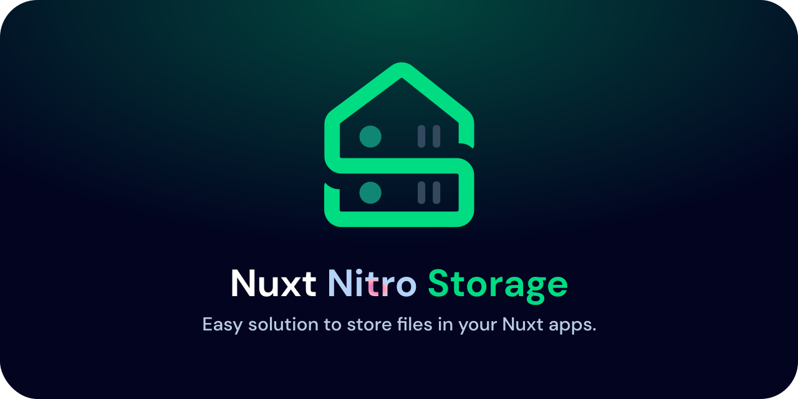

# Nuxt Nitro Storage

[![npm version][npm-version-src]][npm-version-href]
[![npm downloads][npm-downloads-src]][npm-downloads-href]
[![License][license-src]][license-href]
[![Nuxt][nuxt-src]][nuxt-href]

> ⚠️ WARNING : This project is still experimental and under testing. When I make all of the testing necessary I will be removing this warning. If you encounter any issues please open a [new issue](https://github.com/NyllRE/nuxt-nitro-storage/issues/new).

Easy solution to store files in your nuxt apps. Be able to upload files from the frontend and recieve them from the backend to then save the files in your project.

-  [✨ &nbsp;Release Notes](/CHANGELOG.md)
-  [🏀 Online playground](https://stackblitz.com/github/NyllRE/nuxt-nitro-storage?file=playground%2Fapp.vue)
<!-- - [📖 &nbsp;Documentation](https://example.com) -->

## Features

<!-- Highlight some of the features your module provide here -->

-  📁 &nbsp;Get files from file input and make them ready to send to backend
-  🖴 &nbsp;Store files in your Nuxt backend with Nitro Engine

## Quick Setup

1. Add `nuxt-nitro-storage` dependency to your project

```bash
# Using pnpm
pnpm add -D nuxt-nitro-storage

# Using yarn
yarn add --dev nuxt-nitro-storage

# Using npm
npm install --save-dev nuxt-nitro-storage
```

2. Add `nuxt-nitro-storage` to the `modules` section of `nuxt.config.ts`

```js
export default defineNuxtConfig({
	modules: ['nuxt-nitro-storage'],
})
```

That's it! You can now use Nuxt Storage in your Nuxt app ✨

## Configuration

You can currently configure a single setting of the `nuxt-nitro-storage` module. Here is the config interface:

```js
export default defineNuxtConfig({
	modules: ['nuxt-nitro-storage'],
	storage: {
		// location starts from the root
		location: 'public/files',
	},
})
```

## Usage

### Handling Files in the frontend
You can use Nuxt Storage to get the files from the `<input>` tag:

```html
<template>
	<input type="file" @input="handleFileInput" />
</template>

<script setup>
	// handleFileInput can handle multiple files
	const { handleFileInput, files } = useNitroStorage()
</script>
```
> the `files` return a ref object that contains the files

here's an example of using files to send them to the backend:
```html
<template>
	<input type="file" @input="handleFileInput" />
	<button @click="submit">submit</button>
</template>

<script setup>
const { handleFileInput, files } = useNitroStorage()

const submit = async () => {
	const response = await $fetch('/api/files', {
		method: 'POST',
		body: {
			files: files.value
		}
	})
}
</script>
```


### Handling files in the backend
using Nitro Server Engine, we will make an api route that recieves the files and stores them in the folder `userFiles`
```ts
export default defineEventHandler(async (event) => {
	const { file } = await readBody<{ file: File }>(event)

	await storeFileLocally(
		file.content, // the stringified version of the file
		file.name,    // the name of the file
		'/userFiles'  // the folder the file will be stored in
	)

	return 'success!'
})

interface File {
	name: string
	content: string
}
```

And that's it! Now you can store any file in your nuxt project from the user ✨

<!-- Badges -->

[npm-version-src]: https://img.shields.io/npm/v/nuxt-nitro-storage/latest.svg?style=flat&colorA=18181B&colorB=28CF8D
[npm-version-href]: https://npmjs.com/package/nuxt-nitro-storage
[npm-downloads-src]: https://img.shields.io/npm/dm/nuxt-nitro-storage.svg?style=flat&colorA=18181B&colorB=28CF8D
[npm-downloads-href]: https://npmjs.com/package/nuxt-nitro-storage
[license-src]: https://img.shields.io/npm/l/nuxt-nitro-storage.svg?style=flat&colorA=18181B&colorB=28CF8D
[license-href]: https://npmjs.com/package/nuxt-nitro-storage
[nuxt-src]: https://img.shields.io/badge/Nuxt-18181B?logo=nuxt.js
[nuxt-href]: https://nuxt.com
